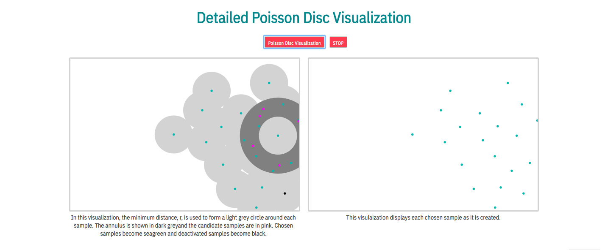
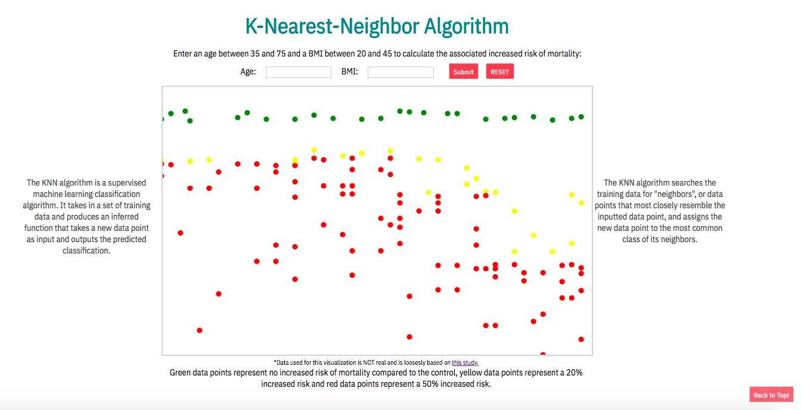

# AlgoVisuo

[AlgoVisuo Live](http://aislinncronin.com/AlgoVisuo/)

AlgoVisuo is a project designed to visually represent algorithms in order to promote deeper understanding and facilitate the recognition of patterns.  It was built using JavaScript, D3.js, HTML and CSS.  AlgoVisuo first looks at three different sampling algorithms and then features a simple machine learning k-nearest-neighbor algorithm.  

### Sampling Algorithms

The first three algorithms in this project are sampling algorithms that can be used for supersampling, or post-filtering.  Supersampling is used in computer graphics to reduce aliasing, or the jagged edges seen on curved images. For optimal results, the sampling algorithms must take a number of samples from a board as evenly spaced apart as possible.  This project features simple random, Mitchell's best candidate and Poisson disc sampling.

Here, the three different algorithms can be run and accompanying visualizations of the algortihms chosen samples, or dots, will appear on the board.  Descriptions of how each algorithm works pops up with each one.  These visualiations show the algorithms in a way that allows viewers to easily compare and contrast.  Viewers can compare how well spaced the samples are placed and at what speed they run relative to one another.

There are also more detailed visualizations of the Mitchell's best candidate and Poisson disc algorithms.  For each run of the algorithm, it is visualized in two different ways to allow viewers to get an even deeper understanding of what is happening at each step.

Lastly, the machine learning k-nearest-neighbor is featured to classify new data points that are inputted by the user. This algorithm takes in a set of training data and produces an inferred function that takes a new data point as input and outputs the predicted classification.  Here, users can enter an age between 35 and 75 and a BMI between 20 and 45 and the algorithm will identify associated increased risk of mortality and clasify that data point.

In the visualization, the circle produced around the new entered data point encircles the "neighbors", or most similar data points, to the new data point.  The color of the circle represents the new data points decided classification.

In the algorithm used, 11 is the number of neighbors being considered.

## Languages and Libraries

* D3.js
* JavaScript 
* HTML
* CSS

