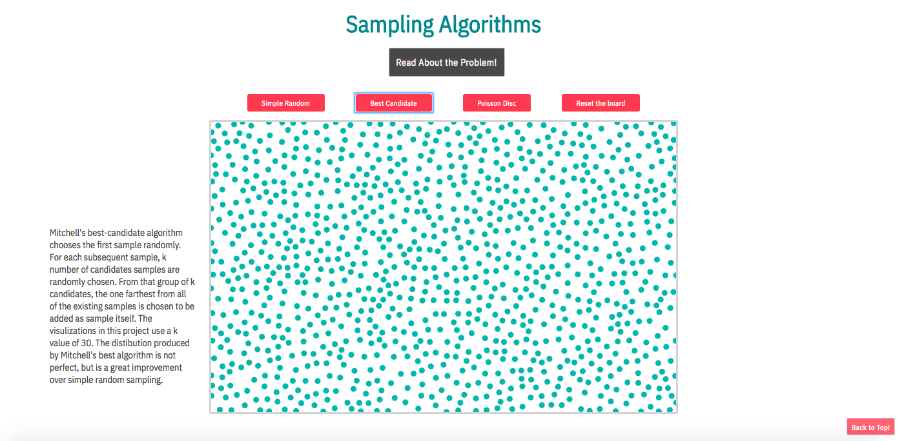

# AlgoVisuo

[AlgoVisuo Live](http://aislinncronin.com/AlgoVisuo/)

AlgoVisuo is a project designed to visually represent algorithms in order to promote deeper understanding and facilitate the recognition of patterns.  It was built using JavaScript, D3.js, HTML and CSS.  AlgoVisuo first looks at three different sampling algorithms and then features a simple machine learning k-nearest-neighbor algorithm.  

## Languages and Libraries

* D3.js
* JavaScript 
* HTML
* CSS

## To Do

Things I plan to work on next:
